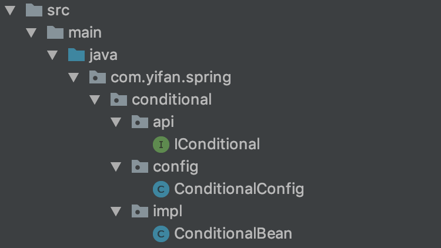

# @Conditional

当满足某个条件时才去创建bean，这时候需要用到@Conditional注解

@Conditional注解需要指定Condition

## demo



IConditional.java是接口，实现类ConditionalBean.java

ConditionalConfig.java实现了spring的Condition.java，用来判断是否满足条件：当条件满足时创建bean；不满足条件时，不创建bean

在这个demo中，当环境变量中有conditional，并且conditional=true的时候，才会创建ConditionalBean对象

代码如下：

**IConditional.java**

```java
package com.yifan.spring.conditional.api;

/**
 * @author yifan
 * @since 2019/5/14 20:50
 */
public interface IConditional {

    void sayHello(String name);
}
```

** ConditionalBean**

```java
package com.yifan.spring.conditional.impl;

import com.yifan.spring.conditional.api.IConditional;

/**
 * @author yifan
 * @since 2019/5/14 20:52
 */
public class ConditionalBean implements IConditional {
    @Override
    public void sayHello(String name) {
        System.out.println("This is conditional bean: hello " + name);
    }
}
```

** ConditionalConfig**

```java
package com.yifan.spring.conditional.config;

import com.yifan.spring.conditional.impl.ConditionalBean;
import org.springframework.context.annotation.Bean;
import org.springframework.context.annotation.Condition;
import org.springframework.context.annotation.ConditionContext;
import org.springframework.context.annotation.Conditional;
import org.springframework.context.annotation.Configuration;
import org.springframework.core.env.Environment;
import org.springframework.core.type.AnnotatedTypeMetadata;

/**
 * @author yifan
 * @since 2019/5/13 13:25
 */
@Configuration("com.yifan.spring.conditional")
public class ConditionalConfig implements Condition {

    @Bean
    @Conditional(ConditionalConfig.class)
    public ConditionalBean conditionalBean() {
        return new ConditionalBean();
    }

    @Override
    public boolean matches(ConditionContext context, AnnotatedTypeMetadata metadata) {
        Environment env = context.getEnvironment();
        String value = env.getProperty("conditional");
        return "true".equals(value);
    }
}
```

测试类中Properties.java用来加载测试需要用到的properties

** Properties.java**

```java
package com.yifan.spring.conditional;

import org.springframework.context.annotation.Configuration;
import org.springframework.context.annotation.PropertySource;

/**
 * @author 金奇樑(hzjinqiliang)
 * @since 2019/5/14 22:21
 */
@Configuration
@PropertySource("classpath:conditional/a.properties")
public class Properties {
}
```

Conditional1Test.java 是按条件创建IConditional对象

Conditional2Test.java 是按条件IConditional不创建对象

