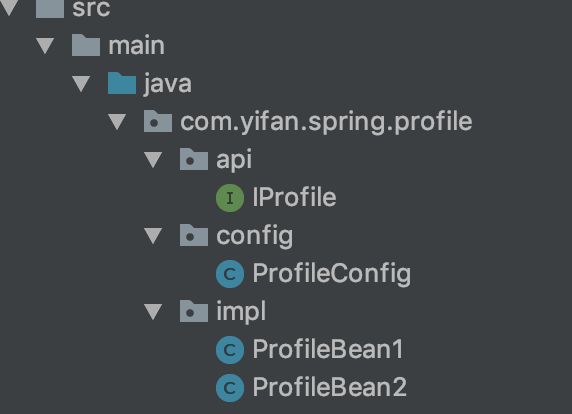

# @Profile


根据不同环境指定的profile生成bean

激活Profile需要依赖两个独立的属性：

- spring.profiles.active
- spring.profiles.default

如果设置了 spring.profiles.active 属性的话， 那么它的值就会用来确定哪个profile是激活的。 
但如果没有设置spring.profiles.active属性的话， 那Spring将会查找spring.profiles.default的值。 
如果spring.profiles.active和spring.profiles.default均没有设置的话， 那就没有激活的profile， 因此只会创建那些没有定义在profile中的bean。

看个具体的例子

## demo



IProfile.java 是接口，有2个实现类ProfileBean1.java和ProfileBean2.java
ProfileConfig.java是用java config的形式配置bean

代码如下：

**IProfile.java**

```java
package com.yifan.spring.profile.api;

/**
 * @author yifan
 * @since 2019/5/13 13:21
 */
public interface IProfile {

    void sayHello(String name);
}
```

**ProfileBean1**

```java
package com.yifan.spring.profile.impl;

import com.yifan.spring.profile.api.IProfile;

/**
 * @author yifan
 * @since 2019/5/13 13:21
 */
public class ProfileBean1 implements IProfile {
    @Override
    public void sayHello(String name) {
        System.out.println("=============bean 1============");
        System.out.println("This is profile bean 1: hello " + name);
        System.out.println("=============bean 1============");
    }
}
```

**ProfileBean2**

```java
package com.yifan.spring.profile.impl;

import com.yifan.spring.profile.api.IProfile;

/**
 * @author yifan
 * @since 2019/5/13 13:23
 */
public class ProfileBean2 implements IProfile {
    @Override
    public void sayHello(String name) {
        System.out.println("=============bean 2============");
        System.out.println("This is profile bean 2: hello " + name);
        System.out.println("=============bean 2============");
    }
}
```

**ProfileConfig**

```java
package com.yifan.spring.profile.config;

import com.yifan.spring.profile.api.IProfile;
import com.yifan.spring.profile.impl.ProfileBean1;
import com.yifan.spring.profile.impl.ProfileBean2;
import org.springframework.context.annotation.Bean;
import org.springframework.context.annotation.Configuration;
import org.springframework.context.annotation.Profile;

/**
 * @author yifan
 * @since 2019/5/13 13:25
 */
@Configuration
public class ProfileConfig {

    @Bean("profile")
    @Profile("profile1")
    public IProfile profile1() {
        return new ProfileBean1();
    }

    @Bean("profile")
    @Profile({"profile2", "profile3", "profile4"})
    public IProfile profile2() {
        return new ProfileBean2();
    }
}
```

看下四个测试类的代码

## 激活 profile1

```java
package com.yifan.spring.profile;

import com.yifan.spring.profile.api.IProfile;
import com.yifan.spring.profile.config.ProfileConfig;
import org.junit.Test;
import org.junit.runner.RunWith;
import org.springframework.test.context.ActiveProfiles;
import org.springframework.test.context.ContextConfiguration;
import org.springframework.test.context.junit4.SpringJUnit4ClassRunner;

import javax.annotation.Resource;

/**
 * @author yifan
 * @since 2019/5/13 13:24
 */
@RunWith(SpringJUnit4ClassRunner.class)
@ActiveProfiles("profile1")
@ContextConfiguration(classes = ProfileConfig.class)
public class AppProfile1Test {

    @Resource
    private IProfile profile;

    @Test
    public void sayHello1Test() {
        profile.sayHello("yifan");
    }
}
```

AppProfile1Test.java激活了profile1，所以会打印出

```
=============bean 1============
This is profile bean 1: hello yifan
=============bean 1============
```

## 激活 profile2

```java
package com.yifan.spring.profile;

import javax.annotation.Resource;

import com.yifan.spring.profile.api.IProfile;
import com.yifan.spring.profile.config.ProfileConfig;
import org.junit.Test;
import org.junit.runner.RunWith;
import org.springframework.test.context.ActiveProfiles;
import org.springframework.test.context.ContextConfiguration;
import org.springframework.test.context.junit4.SpringJUnit4ClassRunner;

/**
 * @author yifan
 * @since 2019/5/13 13:24
 */
@RunWith(SpringJUnit4ClassRunner.class)
@ActiveProfiles({"profile2", "profile3"})
@ContextConfiguration(classes = ProfileConfig.class)
public class AppProfile2Test {

    @Resource
    private IProfile profile;

    @Test
    public void sayHello2Test() {
        profile.sayHello("yifan");
    }
}
```

AppProfile2Test.java激活了profile2，所以会打印出

```
=============bean 2============
This is profile bean 2: hello yifan
=============bean 2============
```

-------
