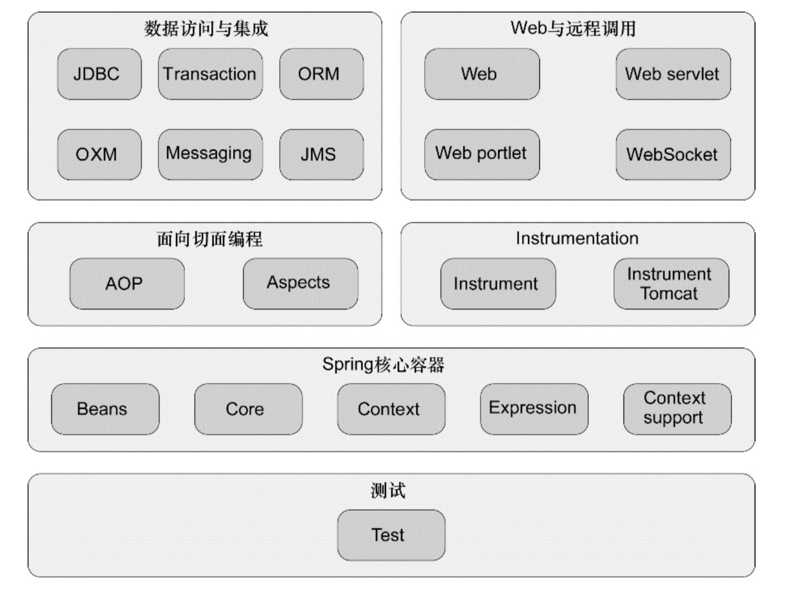

# spring in action demo

最近打算写一点 spring cache 相关的东西，先复习下 spring，那就从 srping in action 下手吧

这里主要针对 spring in action 做点笔记，记录一些注解的作用和基本原理

# spring jar
spring 框架有非常多 jar，看下框图



这里主要学习核心容器

## spring 依赖关系

```java
spring-core
   spring-jcl
spring-beans
   spring-core
spring-expression
   spring-core
spring-context
   spring-aop
   spring-beans
   spring-expression
spring-context-support
   spring-beans
   spring-context
   spring-aop
   spring-expression
   spring-core
```

因为经常用到aop，看下spring aop的依赖关系

```
spring-aop
   spring-beans
   spring-core
```


# 用法

主要是注解的用法

## @Profile
https://github.com/HadesJK/spring-in-action-demo/blob/master/Profile.md

## @Conditional


